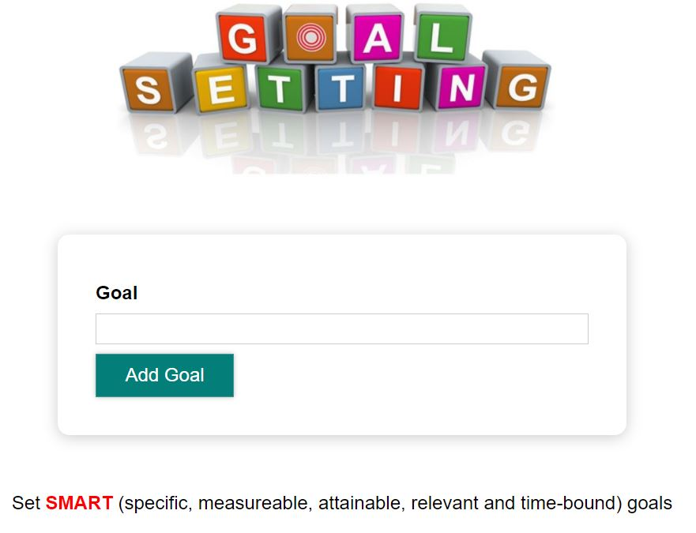
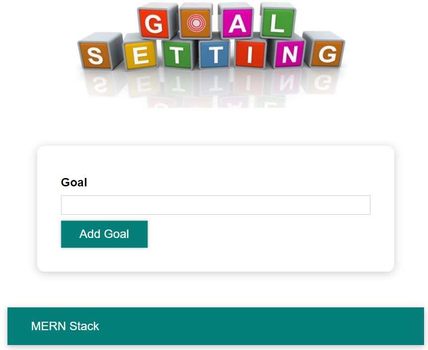
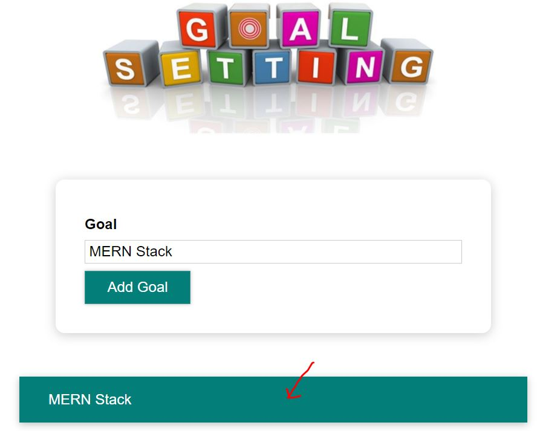
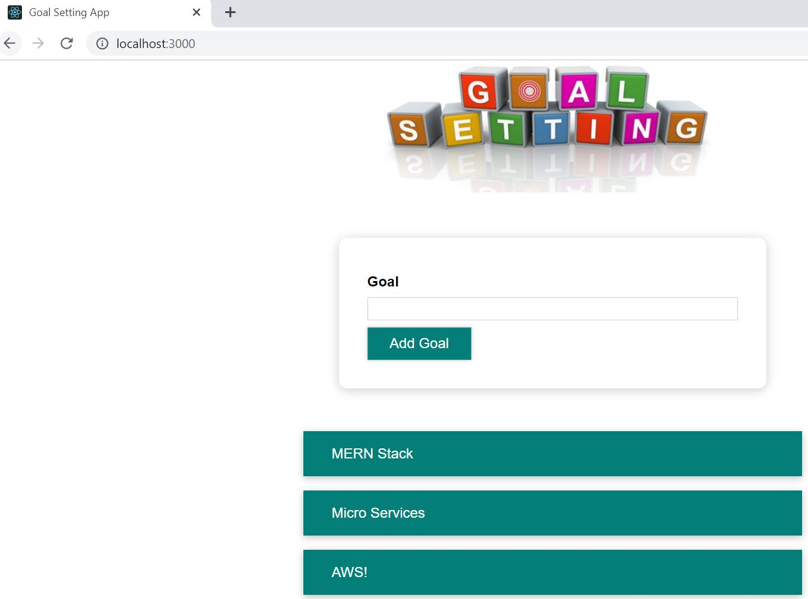
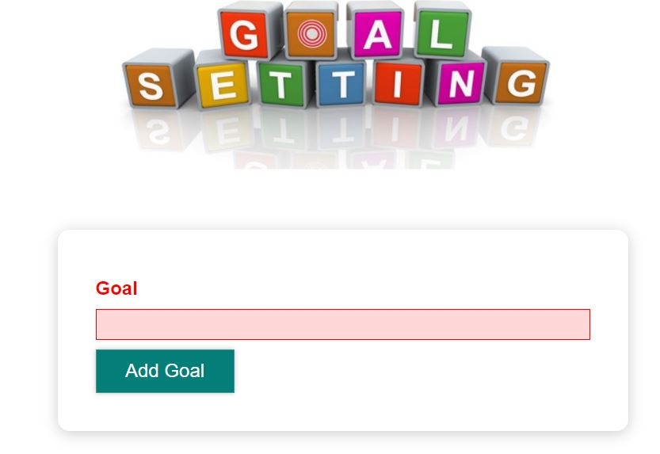

# goal-setting-app-react
**Goal Setting Application Developed Using React**

This application is developed using React library.

Application features include -

1. Add Goal
2. Delete Goal
3. Goal Summary
4. Validation

* <b>Home Page</b>
  
* <b>Add Goal</b>
  * In this user can add a goal
  * Enter the Goal and click on Add Goal button 
    
  * Now added goal displayed in goals summary
    
* <b>Delete Goal</b>
  * Delete a completed goal by clicking on it  
    
  * Now goal disappears from goals summary
    
* <b>Goal Summary</b>
  
* <b>Validation</b>
  * Clicking on Add Goal Button with empty goal results in validation error
  
    
To run this follow below steps

1. Clone the repo https://github.com/pavanuppuluri/goal-setting-app-react.git
2. Now open command prompt and go to goal-setting-app-react folder
3. Run npm install This command installs required dependencies from package.json
4. Run npm start

It should run the react application at http://localhost:3000

Some of the concepts I used in this application are -
* React **functional components**
* React **props**
* React **state**
* React **event handling**
* Validations
* **Styling**
* **JavaScript**

Happy Coding!!!

